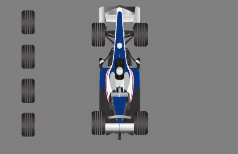
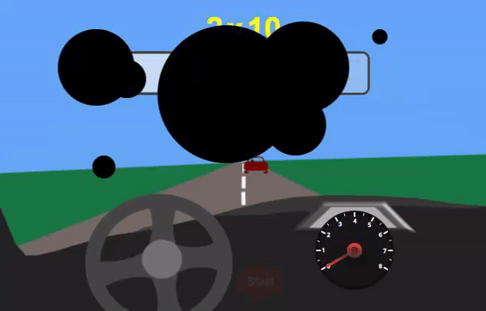
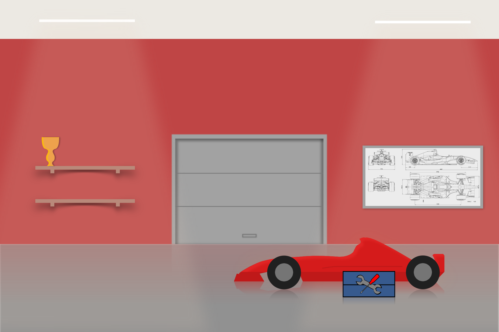
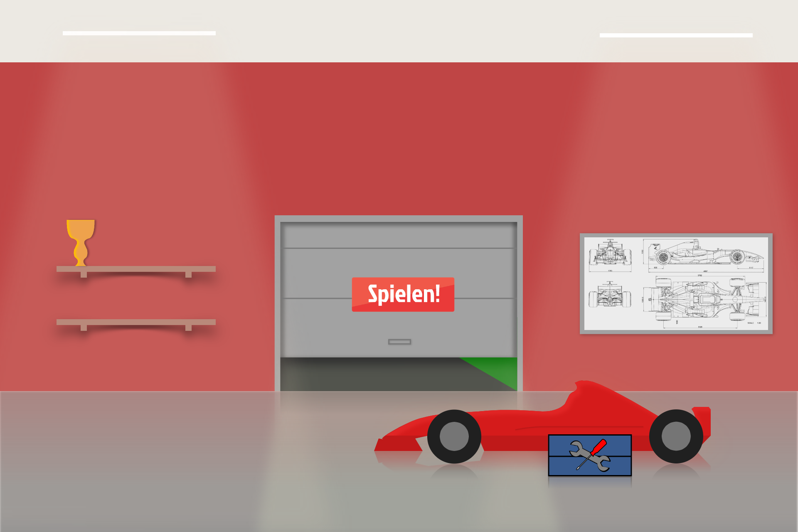

# Practical software course interface design: Formel 1x1

This project was part of the module "Softwarepraktikum Schnittstellenentwurf", which literally translates to "practical software course interface design", in 2020/2021, my third semester at the Julius-Maximilians-Universität of Würzburg. It was created in collaboration with four other students. Unfortunately, the project won't run without a database, but you should be able to set up your own connection in [conf/application.conf](conf/application.conf) using the SQL script provided in [docs/Formel1x1DB.sql](docs/Formel1x1DB.sql). The video presentation of the final submission, which can be viewed [here](docs/formel1x1.mp4), also gives a quick overview of the complete application.

# The project

We used the play framework, a web application framework, to create a serious game centered around math problems and racing called Formel 1x1, *Formel* being the german word for *equation*. We used JDBC to connect to a MySQL database storing login data, scores, etc.

# Authoring tool

An authoring tool was created using JavaFX to provide a graphical user interface to manipulate the data of the database. This tool can also be seen in the [video presentation](docs/formel1x1.mp4), and I have also published the code here: [practical-software-course-interface-design-authoring-tool](https://github.com/monaroehm/practical-software-course-interface-design-authoring-tool)

# My contributions

I did a bit of everything (CSS, JavaScript, SQL, Java, FXML) but my focus was the **logic of the game mechanics** which was mostly JavaScript:  

During the game, little minigame events are triggered every 20-30 seconds: [gameEventHandler.js](public/javascripts/gameEventHandler.js)  
These Events include:  
- [changing the tires of the vehicle](public/javascripts/changeTiresEvent.js)  

- [cleaning dirt/ink off the screen](public/javascripts/inkEvent.js)  

[Items](public/javascripts/items.js) are earned after the games and can be used while playing. All information about the ownership of items are stored in a database and updated with the according server-side [QuizController](app/controllers/QuizController.java) deriving from play.mvc.Controller, using the Fetch API to send requests from client to server.

I also created the art of the [main garage hub](public/images/GarageDefault.png), including various hover effects for the [door](public/images/GaragePlayHover.png) and other clickable areas, using [Gravit Designer](https://www.designer.io/en/):

